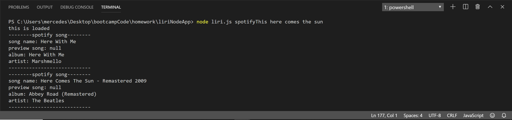
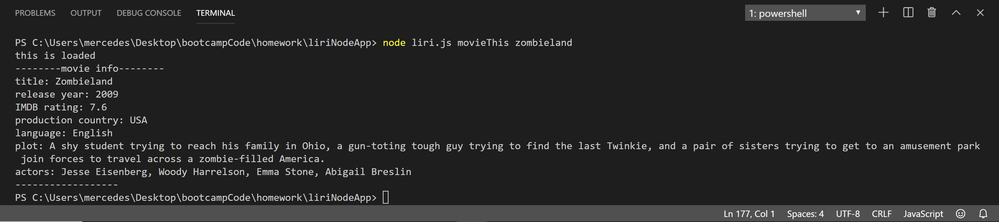

# liriNodeApp

**What LIRI does:**

- LIRI is kind of like Apple's Siri. LIRI stands for "Language and Interpretation and Recognition Interface". This is a command line node app that will take in certain parameters and give back data based on those parameters.

---

**How to use LIRI:**

- LIRI searches Spotify for songs, Bands in Town for concerts, and OMDB for movies.

The following input-

> node liri.js spotifyThis here comes the sun

will output-

> - The Beatles (artist)
> - Here Comes The Sun (song name)
> - preview link of song from Spotify
> - Abbey Road (album)*

Screenshot of terminal output-

The following input-

> node liri.js movieThis zombieland

will output-

> - Zombieland (movie name)
> - 2009 (year movie came out)
> - 7.6/10 (IMDB rating)
> - 90% (Rotten Tomatoes rating)
> - USA (country of production)
> - English (language of movie)
> - plot of movie
> - actors in movie

Screenshot of terminal output-

The following input- 

> node liri.js concertThis the band camino

will output- 

> - El Rey (name of venue)
> - Los Angeles, CA (location of venue)
> - 10/14/2019 (date of venue)

The following input-

> node liri.js doWhatItSays

will output-

> - Backstreet Boys
> - I Want It That Way
> - preview link of I Want It That Way
> - The Hits--Chapter One*

Screenshot of terminal output-

*(doWhatItSays info comes from the random.txt file that is stored)*

---

**Link to deployed version of app-**

- https://mercedeswalsh.github.io/liriNodeApp/

---

**Technologies used in LIRI**

- Node.js

- HTML

- JavaScript

- Spotify API

- Bands In Town API

- OMDB API

- GitHub

---

**My role in app development**

- Developer of LIRI through Coding Bootcamp at UCI

---

**Placeholder to add photos**

- 